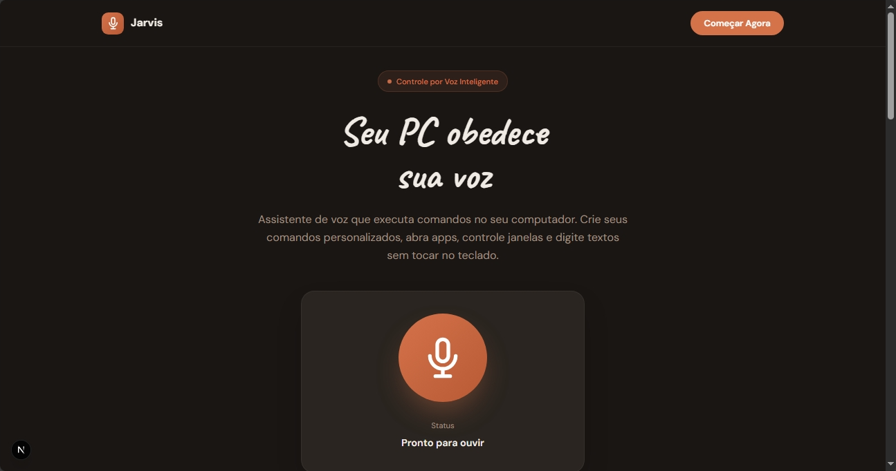

# 🎤 VoiceAI - Assistente de Voz para PC - SEM IA

Controle seu computador usando apenas sua voz! Assistente inteligente que executa comandos do sistema através de reconhecimento de voz.



## ✨ Características

- 🎯 **Reconhecimento de voz preciso** - Web Speech API do navegador
- ⚡ **Execução instantânea** - Comandos executados em tempo real
- 🗣️ **Feedback por voz** - Resposta natural usando síntese de voz
- 🔒 **100% Local** - Tudo roda no seu PC, privacidade total
- 🌐 **Bilíngue** - Suporte para Português e Inglês
- 🎨 **Interface moderna** - Landing page responsiva e elegante

## 🏗️ Arquitetura

```
┌─────────────────────────────────────┐
│  Frontend (Next.js)                 │
│  - Web Speech API (reconhecimento)  │
│  - Speech Synthesis (voz)           │
│  - Interface React                  │
└──────────────┬──────────────────────┘
               │ HTTP (localhost:5000)
               ▼
┌─────────────────────────────────────┐
│  Backend (Python Flask)             │
│  - Processa comandos                │
│  - pyautogui (controle do sistema)  │
└─────────────────────────────────────┘
```

## 🚀 Instalação

### Pré-requisitos

- Node.js 18+
- Python 3.8+
- Windows (para pyautogui)

### 1. Clone o repositório

```bash
git clone https://github.com/zGabriel-Passos/jarvis-simple.git
cd jarvis-simple
```

### 2. Instale dependências do Frontend

```bash
npm install
```

### 3. Instale dependências do Backend

```bash
cd backend-python
pip install -r requirements.txt
```

## 🎮 Como Usar

> ⚠️ **IMPORTANTE:** Este projeto precisa de **2 servidores rodando simultaneamente**:
> - **Terminal 1:** Servidor Python (Backend) na porta 5000
> - **Terminal 2:** Servidor Next.js (Frontend) na porta 3000

### 1. Inicie o Backend Python (Terminal 1)

```bash
cd backend-python
python main.py
```

✅ O servidor Flask rodará em `http://localhost:5000`

### 2. Inicie o Frontend Next.js (Terminal 2)

Abra um **NOVO terminal** (deixe o Python rodando) e execute:

```bash
npm run dev
```

✅ O frontend rodará em `http://localhost:3000`

### 3. Use o Assistente

1. Abra http://localhost:3000 no navegador
2. Clique no botão roxo do microfone
3. Permita acesso ao microfone quando solicitado
4. Fale um comando (ex: "abra o navegador")
5. O assistente responderá e executará o comando!

### 📺 Exemplo Visual dos Terminais

```
Terminal 1 (Python):              Terminal 2 (Next.js):
┌─────────────────────┐          ┌─────────────────────┐
│ $ cd backend-python │          │ $ npm run dev       │
│ $ python main.py    │          │                     │
│                     │          │ ▲ Next.js 14.0.0    │
│ * Running on        │          │ - Local: :3000      │
│   http://127.0.0.1  │          │                     │
│   :5000             │          │ ✓ Ready in 2.5s     │
│                     │          │                     │
│ [MANTENHA ABERTO]   │          │ [MANTENHA ABERTO]   │
└─────────────────────┘          └─────────────────────┘
```

## 📝 Comandos Disponíveis

Veja a lista completa em [COMANDOS.md](COMANDOS.md)

### Exemplos Rápidos:

- **"abra o whatsapp"** - Abre o WhatsApp
- **"nova aba"** - Abre nova aba no navegador (Ctrl+T)
- **"copiar"** - Copia seleção (Ctrl+C)
- **"escreva olá mundo"** - Digita "olá mundo"
- **"pressione enter"** - Pressiona a tecla Enter

## 🛠️ Tecnologias

### Frontend
- **Next.js 14** - Framework React
- **TypeScript** - Tipagem estática
- **Tailwind CSS** - Estilização
- **Web Speech API** - Reconhecimento e síntese de voz

### Backend
- **Flask** - Framework web Python
- **pyautogui** - Automação do sistema
- **Flask-CORS** - Comunicação cross-origin

## 📁 Estrutura do Projeto

```
jarvis-simple/
├── app/                      # Next.js App Router
│   ├── page.tsx             # Página principal
│   ├── layout.tsx           # Layout global
│   └── globals.css          # Estilos globais
├── components/              # Componentes React
│   └── LandingPage.tsx      # Landing page + assistente
├── backend-python/          # API Python
│   ├── main.py              # Servidor Flask
│   ├── voice_commands.json  # Configuração de comandos
│   └── requirements.txt     # Dependências Python
├── README.md                # Este arquivo
└── COMANDOS.md              # Lista de comandos
```

## ⚙️ Configuração

### Adicionar Novos Comandos

Edite `backend-python/voice_commands.json`:

```json
{
  "sentence": ["seu comando", "variação do comando"],
  "action": "nome_da_acao",
  "keys": ["ctrl", "tecla"],
  "delay": 0.2,
  "speak": "Texto que o assistente falará"
}
```

### Comandos Dinâmicos

Para comandos que capturam texto adicional:

```json
{
  "sentence": ["escreva"],
  "action": "write_text",
  "type": "dynamic",
  "delay": 0.1,
  "speak": "Escrevendo"
}
```

## 🔧 Troubleshooting

### Microfone não funciona
- Use Chrome ou Edge (melhor suporte)
- Permita acesso ao microfone
- Use HTTPS ou localhost

### Comandos não executam
- Verifique se o backend Python está rodando
- Teste a API: `curl -X POST http://localhost:5000/execute -H "Content-Type: application/json" -d "{\"text\":\"copiar\"}"`

### Erro de CORS
- Certifique-se que flask-cors está instalado
- Backend deve rodar na porta 5000

## 🎯 Roadmap

- [ ] Adicionar mais comandos pré-configurados
- [ ] Interface para criar comandos personalizados
- [ ] Histórico de comandos executados
- [ ] Suporte para macros (sequência de comandos)
- [ ] Modo "sempre ouvindo" em background
- [ ] Suporte para Linux e macOS

## 📄 Licença

MIT License - Sinta-se livre para usar e modificar!

## 🤝 Contribuindo

Contribuições são bem-vindas! Abra uma issue ou pull request.

---

**Desenvolvido com ❤️ usando Next.js e Python**
